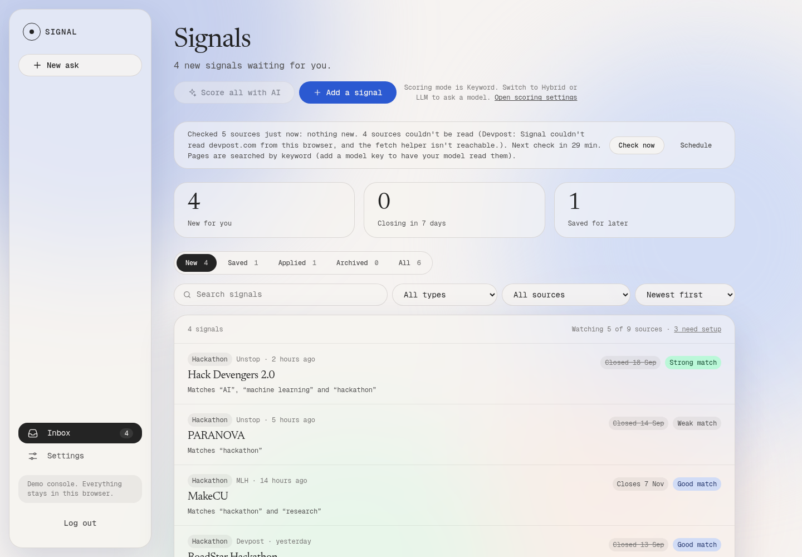
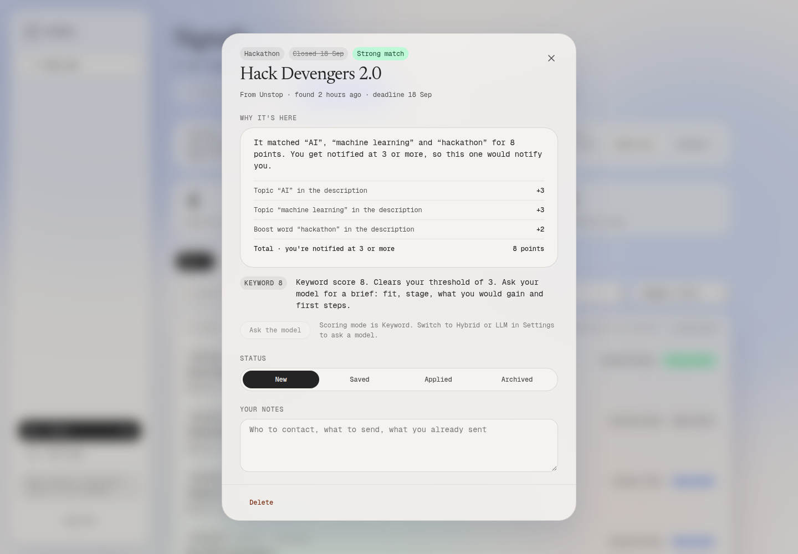
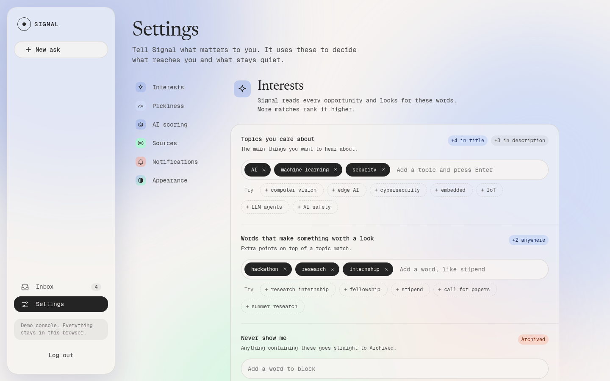
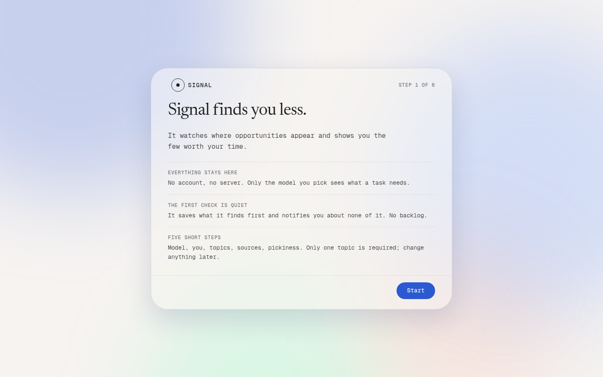

<div align="center">

# Signal

**It doesn't find you more. It finds you less.**

A desktop app that watches where opportunities appear, scores them against what you said you
care about, and tells you about the few worth your time.

[](https://github.com/Taran8851/Signal/actions/workflows/desktop.yml)

Linux · Windows · MIT licence · your own model key · no account

[Screenshots](#screenshots) · [Build it](#build-it) · [How it decides](#how-it-decides) ·
[What works today](#what-works-today-and-what-does-not) · [Measured numbers](#measured-numbers)

<a href="docs/screenshots/inbox.png"></a>

</div>

## Why

Most students miss opportunities not because none exist, but because they decide they are too
early, or they never go looking. Signal watches the places opportunities appear, in the fields
you choose, and tells you plainly which ones fit where you are now: hackathons, calls for papers,
research programmes, fellowships, open-source and community programmes, and internships. It
weighs each one by how it fits you, not by prestige.

Signal is not a job board, an internship listing site or a placement service. It promises no
outcome. It is a filter, not a feed.

Signal runs on your laptop, with your own model key. There is no account and no Signal server in
a build made from this repo. It is module 01 of Student OS; no other module is built.

## Screenshots

Taken from the console running in a browser, with its built-in demo rows. Click one to see it
full size.

| Every signal says why it is here | You define what counts |
|---|---|
| <a href="docs/screenshots/signal-detail.png"></a> | <a href="docs/screenshots/settings.png"></a> |
| The terms that matched, the points each one added, and the total against your threshold. | Interest terms, boost terms, exclude terms, threshold, sources, notifications. |

| Set up in five short steps |
|---|
| <a href="docs/screenshots/setup.png"></a> |
| The first check stores what it finds and notifies you about none of it. No backlog. |

There is no screenshot of the Ask page here. It only runs in the desktop app, with a model
connected.

## Build it

You need Node 22 or newer, Rust (stable, from https://rustup.rs), and cmake and clang. One
dependency builds V8 and BoringSSL.

<details>
<summary><b>Linux (Debian / Ubuntu)</b></summary>

```sh
sudo apt-get install -y build-essential cmake libclang-dev libwebkit2gtk-4.1-dev \
  libayatana-appindicator3-dev librsvg2-dev patchelf

git clone https://github.com/Taran8851/Signal.git
cd Signal/app/desktop
npm ci
npx tauri dev        # run it
npx tauri build      # .deb and AppImage
```

</details>

<details>
<summary><b>Windows</b></summary>

Install the Visual Studio C++ build tools and [NASM](https://www.nasm.us), and put NASM on your
`PATH`. WebView2 ships with Windows 11.

```sh
git clone https://github.com/Taran8851/Signal.git
cd Signal/app/desktop
npm ci
npx tauri dev                          # run it
npx tauri build --bundles nsis,msi     # installers
```

</details>

<details>
<summary><b>Android and macOS</b></summary>

An Android project is in `app/desktop/src-tauri/gen/android/`. Building it needs the Android SDK
and NDK (`npx tauri android build`). macOS has not been built or tested.

</details>

<details>
<summary><b>No toolchain: run the console in a browser</b></summary>

The UI is plain HTML, CSS and JavaScript, with no build step. From the repo root:

```sh
python3 -m http.server 8000
```

Then open http://localhost:8000/app/frontend/login.html (any email and password). In a browser
the console keeps everything in `localStorage` and can only read sources that allow cross-origin
requests. The desktop app reads them through its own fetcher instead, and the Ask page only runs
there.

</details>

<details>
<summary><b>Let GitHub build it for you</b></summary>

Fork the repo and open the **Actions** tab. `.github/workflows/desktop.yml` builds Windows and
Linux installers on every push to `main` and keeps them as artifacts on the run. It needs no
secrets; the insider and upload steps skip themselves.

</details>

The first build is slow, because it compiles V8. Installers land in
`app/desktop/src-tauri/target/release/bundle/`.

Tests for the shared scoring rules need Node 22.18 or newer and no install step:

```sh
cd packages/core && npm test
```

## How it decides

Two ways to decide, on one pipeline. Exclude terms and dedupe run before either.

| | Heuristic search | LLM socket |
|---|---|---|
| Needs a key | No | Yours: Anthropic, an OpenAI-compatible endpoint, or a local server (Ollama, LM Studio) |
| Output | Match strength, an integer | Relevance, 0 to 10, and a brief |
| Explains itself | Lists the terms that matched | Why it fits you, whether your stage is enough, what you would gain, what it asks for, rough effort, first steps |
| Default threshold | 3 | 6 |
| Sends anything out | Nothing | The item, to the model you picked |

<details>
<summary><b>The keyword rules, exactly</b></summary>

- An **interest** term adds **+4** if it is in the title, **+3** if it is only in the body. The
  title wins; the two do not add up.
- A **boost** term adds **+2** for a hit anywhere.
- An **exclude** term archives the item. It stays stored, so it stays deduped, but it never
  reaches the inbox.
- Matching ignores case, respects word boundaries and allows a plural. "AI" does not fire on
  "said", and "IoT" does not fire on "idiot".
- The default threshold is **3**: one interest term anywhere clears it. Set it to 4 to require an
  interest term in the title, or 6 for a title interest plus a boost term.
- Items are deduped on source and ID. A repeat never counts as new.
- Sort by recent (default), deadline, or match strength.
- A watched page changing, or a direct message, notifies you whatever its score.
- The first run of a source stores everything and notifies you about nothing.

</details>

<details>
<summary><b>Sources, and what Signal will not read</b></summary>

Beyond the built-in sources you can add your own: an RSS/Atom feed, a JSON API with a field
mapping, a page to watch, or a social feed through a feed URL (for example an X account via an
RSS bridge). Only add URLs you are allowed to read. Signal identifies itself honestly, refuses
pages whose robots.txt disallows them, and always refuses private network addresses.

Two research features are the exception, and both are **off by default**: the `ddgs` metasearch
provider and Stealth reading. When you turn them on, Signal presents itself as a normal browser.
The app says so next to each switch. Built-in sources and scheduled checks never use them unless
you turn them on.

</details>

<details>
<summary><b>Use the research tools from an MCP client</b></summary>

`signal-desktop --mcp` serves Signal's `search_web` and `read_page` tools over stdio, for Claude
Code, Claude Desktop or any MCP client. It uses the same search providers, keys and limits you
set in the app.

</details>

## What works today, and what does not

| Part | State |
|---|---|
| Desktop app (`app/desktop/`) | **Works** on Linux and Windows. Tray, background checks, system notifications, single instance. |
| Console (`app/frontend/`) | **Works.** Signals, notes, statuses, preferences and your own sources are stored on your machine. |
| Heuristic search | **Works, no key.** Every row says which terms matched. Default scoring mode. Sends nothing. |
| LLM socket with brief (`app/frontend/ai.js`) | **Works, with your own model.** Scoring mode Keyword / Hybrid / LLM, a daily call cap, fallback to the keyword score on errors, and "Suggest my terms" with a dry run. Requests go straight from the app to your provider. |
| Custom sources (`app/frontend/sources.js`) | **Works.** RSS/Atom, JSON API with field mapping, web page to watch, social feed via a feed URL. |
| Research agent (`app/frontend/agent.js`) | **Works, with your own model.** Searches the web and reads pages. What it finds is added to the inbox only when you press Add. Web search needs a Firecrawl key or one of the opt-in providers. |
| Shared scoring rules (`packages/core/`) | **In progress.** TypeScript re-implementation of the reference rules, with tests. Not used by any page yet. |
| Collector (`reference/signal/`) | **Reference code only.** The earlier single-user collector (SQLite, keyword scoring, Telegram). It is not built or run from this repo. |
| Hosted app with accounts | **Not built.** |
| Insider builds | The code path exists (an invite code instead of a key). It needs a gateway address this repo does not contain, so a build from source never uses it. |

## Measured numbers

From one run of the reference collector, 2026-09-11, 11:03 to 20:41 UTC (9 h 38 min).

| Figure | Value |
|---|---|
| Signals collected | 300 |
| Scored 0 (matched nothing in the user's lists) | 170 (57%) |
| Cleared the default threshold of 3 | 59 |
| Carry a real deadline | 219 |
| Actually notified | 2 |

<details>
<summary><b>Two constraints on these figures</b></summary>

- **Seven sources had data, not nine.** Discord bot, RSS / Google Alerts, Page watch and manual
  entries had zero rows because they need a feed URL, page URL or bot invite. Nine sources are
  implemented in the reference collector; any figure from this run covers seven.
- **"2 notified" is not a filtering result.** It is low because the first run stores
  everything and notifies about nothing (backfill). It shows the backfill rule works, nothing more.

</details>

There is no other measured figure. The keyword score is called match strength. Nothing has been
measured about how good LLM relevance is.

## Repo layout

```
app/
  frontend/          the console: pages, scripts, styles. No build step.
  desktop/           Tauri 2 project. scripts/copy-app.mjs copies ../frontend into dist/;
                     src-tauri/ is the Rust side (fetcher, search, page reading, MCP server).
packages/core/       shared scoring rules and tests (in progress)
reference/signal/    the earlier collector and its admin UI, read-only reference
ref/                 design tokens the styles are built from
docs/screenshots/    the images on this page
.github/workflows/   the Windows and Linux build
```

The website is not in this repo.

## Credits and licences

Signal is released under the [MIT licence](LICENSE).

- **[Tauri](https://tauri.app)** (MIT / Apache-2.0) is the app shell.
- **[Obscura](https://github.com/h4ckf0r0day/obscura)** (Apache-2.0) is linked in to read pages
  that need JavaScript. It is pinned to one commit in `Cargo.toml`.
- Other Rust crates are listed in `app/desktop/src-tauri/Cargo.toml`, each under its own licence.
- **Newsreader** (Production Type) and **Geist Mono** (Vercel), loaded from Google Fonts. Both
  are licensed under the SIL Open Font License 1.1.
- The console itself uses no JavaScript libraries.
